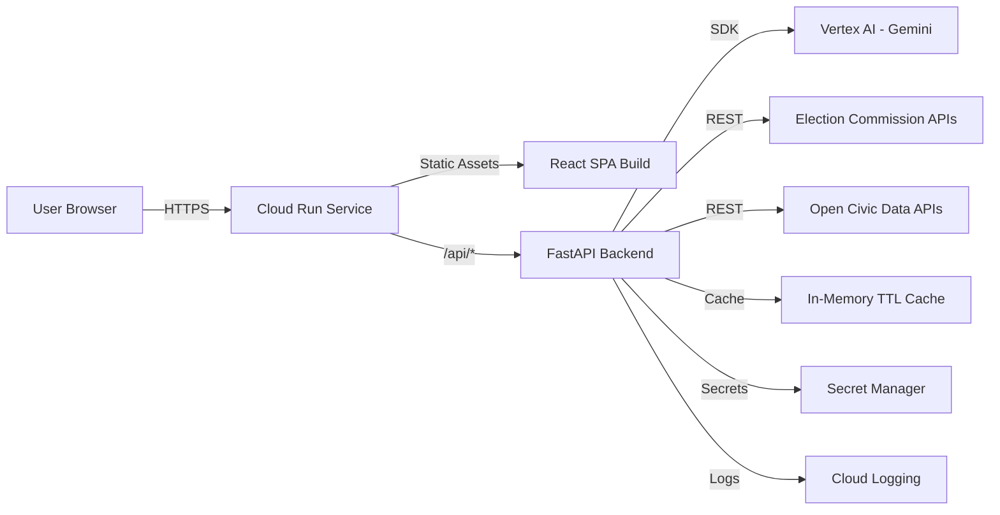

### **A comprehensive plan, system design, UI blueprint, and data strategy for an interactive Election Process Education assistant — built on Google Antigravity, deployed to Cloud Run, and powered by Gemini via Vertex AI, with all election content sourced live from official Election Commission APIs and open civic data platforms rather than hard-coded into the repo.**

Below is an end-to-end build plan structured so you can execute it inside Google Antigravity, stay within the 1 MB public-repo limit, and satisfy every mandatory requirement.

---

## **1. Project Overview**

The product is a conversational, visual, step-by-step guide that demystifies how elections work — who can vote, how to register, what the timeline looks like, how nominations and polling proceed, how votes are counted, and how results are declared. Users can ask natural-language questions ("When does voter registration close in my state?", "What is a Form 6?", "Explain the Model Code of Conduct"), follow an interactive timeline, take short quizzes, and receive answers grounded in live data pulled from official election commission endpoints — never from static content baked into the repo.

The assistant targets three audiences: first-time voters who need onboarding, civic-education students who need structured explanations, and general citizens who want quick, trustworthy answers during an active election cycle.

---

## **2. Mandatory Compliance Checklist**

| Requirement | How it is satisfied |
|---|---|
| Google Antigravity | Entire project scaffolded, coded, and iterated inside Antigravity workspaces; agents generate backend, frontend, IaC, and tests |
| Google Cloud Run | Single containerized service (FastAPI + static React build) deployed; public HTTPS URL submitted as live preview |
| GCP | Project hosts Cloud Run, Vertex AI, Secret Manager, Cloud Logging, Artifact Registry |
| Vertex AI | Enabled in console; Gemini accessed through Vertex AI SDK; API key/service account generated here |
| Gemini API (via Vertex AI) | Powers chat, summarization, quiz generation, and retrieval-augmented answers |
| GitHub public repo, single branch, <1 MB | `main` branch only; no datasets committed; `.gitignore` excludes builds, caches, node_modules; data fetched at runtime via APIs |

---

## **3. High-Level Architecture**



A single Cloud Run container serves both the compiled React app and the FastAPI endpoints under `/api/*`. The backend orchestrates three things: (a) calls to external election APIs for factual data, (b) calls to Vertex AI Gemini for natural-language understanding and explanation, and (c) a lightweight in-memory cache with TTL so repeated questions don't hammer upstream APIs. Secrets (Vertex AI credentials, any API tokens) live in Secret Manager and are mounted as environment variables at deploy time.

---

## **4. System Design**

### **4.1 Backend (FastAPI, Python 3.11)**

The backend is deliberately thin — it is a retrieval-augmented wrapper around Gemini. Every user question flows through a **RAG pipeline**: the query is classified (timeline, procedure, definition, eligibility, location-specific), the classifier decides which external API to hit, the API response is normalized into a compact JSON "context packet," and that packet is passed to Gemini along with the original question and a strict system prompt that forces citation of the source URL.

Core endpoints:

- `GET /api/health` — liveness probe for Cloud Run
- `POST /api/chat` — main conversational endpoint; body `{ "message": str, "session_id": str, "locale": str }`
- `GET /api/timeline?country=IN&election_type=general` — returns a structured timeline pulled live from the ECI/state API
- `GET /api/steps/{topic}` — returns ordered steps for topics like `register`, `vote`, `nominate`, `count`
- `GET /api/glossary/{term}` — returns a definition generated by Gemini, grounded in an official source
- `POST /api/quiz` — generates a 5-question quiz on a requested topic via Gemini
- `GET /api/sources` — lists every upstream data source and last-fetched timestamp (transparency)

The RAG prompt template enforces three rules: answer only from provided context, cite the source URL, and say "I don't have verified information on that" when context is empty — this prevents hallucinated election facts.

### **4.2 Frontend (React + Vite + Tailwind)**

Three primary views share a persistent chat drawer:

1. **Home / Chat** — hero input, suggested starter questions ("How do I register?", "What is EVM?"), and a streaming Gemini response panel with inline citations.
2. **Interactive Timeline** — a horizontal scrollable timeline rendered from `/api/timeline`; each node expands into a card with dates, legal references, and a "Ask Gemini about this step" button.
3. **Learn Modules** — bite-sized cards for Registration, Nomination, Campaigning, Polling Day, Counting, Results; each card ends with a Gemini-generated quick quiz.

A floating chat widget is available on every page so users can ask contextual questions without losing their place. State is kept in a single Zustand store; streaming responses use `fetch` with `ReadableStream` for token-by-token rendering.

### **4.3 Deployment Pipeline**

A single `Dockerfile` uses a multi-stage build: stage one builds the React app with Vite, stage two installs Python deps and copies the static build into `/app/static`. FastAPI mounts `/app/static` at `/`. The image is pushed to Artifact Registry and deployed with:

```bash
gcloud run deploy election-edu \
  --source . \
  --region asia-south1 \
  --allow-unauthenticated \
  --set-env-vars VERTEX_PROJECT=...,VERTEX_LOCATION=us-central1 \
  --set-secrets GEMINI_SA_KEY=gemini-sa:latest
```

Cloud Run autoscaling is left at defaults (min 0, max 5) to stay within free-tier economics during judging.

---

## **5. Data Plan — Fully API-Driven, Zero Bundled Datasets**

Because the rules forbid shipping data inside the project, every fact the assistant states is fetched live or retrieved through Gemini grounded on a fetched document. The repo contains only a small `sources.yaml` manifest (a few KB) listing endpoints, not payloads.

### **5.1 Primary Sources**

| Source | Purpose | Access |
|---|---|---|
| Election Commission of India (ECI) — `eci.gov.in` open data portal & Voter Helpline APIs | Schedules, candidate lists, polling station lookup, Form-6 flow | Public REST / JSON endpoints; no key for most read operations |
| National Voter Service Portal (NVSP) — `voters.eci.gov.in` | Registration steps, EPIC status | Public endpoints scraped via official JSON where available |
| Google Civic Information API (for US queries) | Polling locations, representatives, election dates | Requires Google API key (same GCP project) |
| data.gov.in election datasets | Historical turnout, constituency metadata | Open CKAN API |
| OpenStates / Ballotpedia public endpoints | US state-level procedures | Public REST |
| Wikipedia REST API | Fallback definitions for glossary terms | Public |

### **5.2 Retrieval Flow**

When a user asks a question, the intent classifier (a small Gemini call with JSON-mode output) returns `{intent, country, state, topic}`. The backend routes to the matching connector module, fetches fresh JSON, trims it to the fields the LLM needs, and feeds it as context. Responses are cached in an in-process LRU with a TTL of 1 hour for schedules and 24 hours for procedural content, since those rarely change within a day.

### **5.3 Data Contracts (internal normalized shape)**

All connectors convert upstream payloads into these three shapes before Gemini sees them:

```json
// Timeline item
{ "phase": "Nomination", "start": "2026-03-20", "end": "2026-03-27",
  "legal_ref": "Section 30, RP Act 1951", "source_url": "https://..." }

// Step
{ "order": 1, "title": "Fill Form 6", "description_md": "...",
  "who": "Citizen ≥18", "source_url": "https://..." }

// Glossary term
{ "term": "Model Code of Conduct", "definition_md": "...",
  "source_url": "https://..." }
```

This normalization is what keeps Gemini's answers consistent regardless of which upstream API changes its schema.

### **5.4 Repo-Size Strategy**

To stay comfortably under 1 MB: no `node_modules`, no `dist/`, no images over 50 KB (use SVG icons only), no committed JSON datasets, lockfiles kept (`package-lock.json`, `poetry.lock`) since they compress well, and a strict `.gitignore` for `__pycache__`, `.venv`, `build/`, `coverage/`. A pre-commit hook runs `du -sh .` and fails if the working tree exceeds 900 KB.

---

## **6. UI Plan**

### **6.1 Design Language**

Calm, civic, trustworthy — deep indigo primary (#1E3A8A), saffron accent (#F59E0B) for CTAs, neutral slate text. Typography: Inter for UI, Source Serif for long-form explanations to signal authority. Every factual claim in the UI carries a small "source" chip linking to the upstream URL — this visibly reinforces that nothing is fabricated.

### **6.2 Key Screens**

The **landing screen** opens with a single large prompt box centered under the headline "Understand the election, one question at a time." Below it sit four starter chips: *Am I eligible to vote?*, *Show me the current election timeline*, *How is a vote counted?*, *What is the Model Code of Conduct?*. Clicking any chip streams a Gemini answer into a side panel while the timeline preview loads beneath.

The **timeline screen** presents a horizontal rail with phase chips (Announcement → Nomination → Scrutiny → Withdrawal → Campaigning → Silence Period → Polling → Counting → Results). Each chip expands into a detail card with live dates fetched from the ECI connector. A persistent "Ask about this phase" button injects the phase JSON into the chat as context so Gemini answers with perfect grounding.

The **learn screen** is a grid of six modules. Each module card has a title, a 2-line summary, an estimated read time, and a "Start" button that opens a guided flow: explanation → diagram (Mermaid-rendered on the client) → 5-question quiz generated on demand by Gemini. Quiz results are stored in `localStorage` only — no backend user state, which keeps the architecture stateless and Cloud-Run-friendly.

A **global chat drawer** slides in from the right on any screen, preserving session context via a `session_id` held in `sessionStorage`.

### **6.3 Accessibility & I18n**

All components meet WCAG AA contrast, full keyboard navigation, ARIA labels on every interactive element, and a language selector that currently offers English and Hindi — translations are produced on the fly by Gemini with a cache key `{text_hash}:{lang}` so we don't retranslate the same string.

---

## **7. Repository Layout**

```
election-edu/
├── app/
│   ├── main.py                 # FastAPI entry
│   ├── routers/
│   │   ├── chat.py
│   │   ├── timeline.py
│   │   ├── steps.py
│   │   ├── glossary.py
│   │   └── quiz.py
│   ├── services/
│   │   ├── gemini.py           # Vertex AI client
│   │   ├── rag.py              # intent + context assembly
│   │   └── cache.py
│   ├── connectors/
│   │   ├── eci.py
│   │   ├── nvsp.py
│   │   ├── google_civic.py
│   │   └── data_gov_in.py
│   └── models/schemas.py
├── web/                        # React + Vite source
│   ├── src/
│   │   ├── pages/
│   │   ├── components/
│   │   └── store/
│   └── package.json
├── sources.yaml                # API endpoint manifest
├── Dockerfile
├── pyproject.toml
├── .gitignore
├── .github/workflows/deploy.yml
└── README.md
```

Expected compressed repo size: ~350–500 KB.

---

## **8. Milestone Timeline (2-Week Sprint inside Antigravity)**

| Days | Deliverable |
|---|---|
| 1 | GCP project, enable Vertex AI, create service account, Artifact Registry, Secret Manager entries |
| 2 | Antigravity workspace scaffolds FastAPI + Vite + Dockerfile + CI workflow |
| 3–4 | Implement ECI, NVSP, Google Civic, data.gov.in connectors with normalized schemas |
| 5–6 | Build RAG pipeline, Gemini prompts, intent classifier, streaming chat endpoint |
| 7–8 | React pages: Home, Timeline, Learn; global chat drawer; citations UI |
| 9 | Quiz generator, glossary, i18n layer |
| 10 | Accessibility pass, Lighthouse >90, prompt-injection tests |
| 11 | Cloud Run deploy, smoke tests against production URL |
| 12 | README with architecture diagram, screenshots, Cloud Run URL |
| 13 | Repo size audit, secret scan, final polish |
| 14 | Submit GitHub link + Cloud Run URL |

---

## **9. Risk & Mitigation Notes**

Upstream election APIs occasionally rate-limit or change schemas mid-cycle — the connector layer isolates that blast radius, and every connector has a `fallback_to_gemini_with_citation_hint` mode that asks Gemini to answer only if it can cite an official `.gov` URL it already knows, otherwise returning a graceful "source temporarily unavailable" message. Prompt-injection from fetched web content is mitigated by stripping HTML, length-capping context to 6 KB, and using Vertex AI's safety filters at default strict settings. Cost is controlled by Cloud Run min-instances=0 and Gemini Flash for classification with Gemini Pro reserved for final answer generation.

This plan gives you a submission-ready project that is genuinely useful, visibly trustworthy because of live citations, and fully compliant with every mandatory rule — built in Antigravity, running on Cloud Run, thinking with Gemini on Vertex AI, and never shipping a single byte of election data inside the repo.