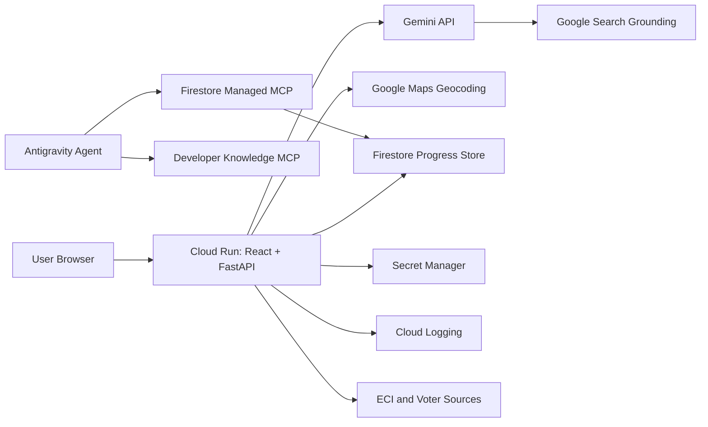

# ElectionEdu Improvement Plan

This plan targets the next PromptWars submission attempt. The first attempt scored 88.13%, with Google Services at 50% and Testing at 77.5%. The goal is to move Google Services above 80%, Testing above 85%, and overall score above 92%.

## 1. Product Direction

ElectionEdu is an India-first civic assistant that explains election processes through grounded AI, official sources, location-aware help, and guided learning.

The app should feel like a real public-service tool, not just a demo:

- Ask election questions and receive cited answers.
- Learn voter registration and polling steps.
- Check eligibility.
- Find location-aware help.
- Take quizzes.
- Save progress.
- Inspect the official sources behind every answer.

## 2. Score Strategy

| Category | Current | Target | Main lever |
|---|---:|---:|---|
| Google Services | 50% | 80-90% | Gemini Search grounding, Maps, Firestore, Developer Knowledge MCP, Cloud Run/Secret Manager docs |
| Testing | 77.5% | 85-90% | Fix failing tests, add API contract tests, add coverage thresholds |
| Code Quality | 83.75% | 90% | Remove stale artifacts, fix lint, align Dockerfile/README/repo |
| Security | 95% | 95%+ | Secret Manager, restricted CORS, safer logging |
| Accessibility | 96.25% | 96%+ | Preserve current strengths, add drawer/dialog semantics |
| Efficiency | 100% | 100% | Keep caching and small repo |
| Alignment | 97% | 97%+ | Keep India election use case focused |

## 3. Google Services Roadmap

### Phase A: Make Gemini reliable and visible

Goal: fix chat failures and show grounded citations.

Steps:

1. Update `backend/services/gemini.py` to use a supported Gemini model.
2. Add Gemini Grounding with Google Search for questions requiring current or official references.
3. Return grounding metadata and citations to the frontend.
4. Add a "Verified with Google Search grounding" source chip when used.
5. Add fallback behavior when Gemini or grounding is unavailable.

Expected scoring effect:

- Stronger Google Services.
- Stronger smart assistant behavior.
- Better trust and usability.

### Phase B: Add Google Maps Platform

Goal: make polling/location help visibly Google-powered.

Steps:

1. Add a backend connector for Google Maps Geocoding API.
2. Normalize user-entered city, district, PIN code, or address into latitude/longitude.
3. Add an `open_maps_url` field to polling and help-center responses.
4. On the frontend, show an "Open in Google Maps" action.
5. Optional: embed a lightweight map only after a user searches, to avoid excess cost.

Expected scoring effect:

- Concrete Google service integration.
- More practical real-world voter usability.

### Phase C: Add Firebase/Firestore progress

Goal: show persistence with Google infrastructure.

Use case:

- Save completed learning modules.
- Save quiz scores.
- Save checklist status.
- Save preferred language.

Steps:

1. Add Firebase app configuration to the frontend.
2. Add anonymous Firebase Auth or a local-first mode with optional sign-in.
3. Store progress in Firestore under `users/{uid}/progress`.
4. Add Firestore Security Rules.
5. Add tests for progress read/write adapter behavior.

Expected scoring effect:

- Google Services increases because the app uses a Google database product.
- Real-world usability increases.

### Phase D: Add Google Developer Knowledge MCP to the build workflow

Goal: prove that Google documentation was used through MCP during development.

Steps:

1. Enable Developer Knowledge API in the Google Cloud project.
2. Configure Developer Knowledge MCP in Antigravity.
3. Use it when implementing Firebase, Maps, Gemini grounding, Cloud Run, and Secret Manager changes.
4. Record the workflow in README and Guide.

Suggested Antigravity config:

```json
{
  "mcpServers": {
    "google-developer-knowledge": {
      "serverUrl": "https://developerknowledge.googleapis.com/mcp"
    }
  }
}
```

Expected scoring effect:

- Improves the narrative around Google ecosystem usage.
- Helps prevent outdated Google API implementation.

### Phase E: Use managed Firestore MCP for developer workflows

Goal: use Google Cloud managed database MCP for schema/rules/query assistance.

Steps:

1. Enable Firestore in the Google Cloud project.
2. Configure the Firestore managed MCP server in the supported Google Cloud workflow.
3. Use IAM rather than shared keys.
4. Use the MCP workflow to inspect collections, validate rules, and troubleshoot progress writes.
5. Document that MCP is for developer/agent workflows while Firestore is the runtime database.

Expected scoring effect:

- Demonstrates newer Google Cloud agentic tooling.
- Strengthens architecture and developer workflow story.

## 4. Testing Roadmap

### Phase 1: Stop failing tests

Fix current known failures:

- Exclude scratch files from pytest collection.
- Remove or ignore `web/test_output.txt`.
- Update stale frontend tests to match current UI copy.
- Fix ESLint errors in `HomePage.tsx` and `api.test.ts`.

Done when:

```powershell
python -m pytest -q -p no:cacheprovider
cd web
npm run lint
npm test -- --run
```

all pass.

### Phase 2: Backend contract tests

Add tests for:

- `/api/health`
- `/api/sources`
- `/api/learn`
- `/api/eligibility`
- `/api/quiz`
- `/api/chat` fallback
- Connector timeout and fallback behavior
- Citation presence for grounded answers

Use `pytest`, `httpx.AsyncClient`, and dependency mocking.

### Phase 3: Frontend behavior tests

Add tests for:

- Home page renders.
- Chat drawer sends a message and handles fallback.
- Eligibility wizard submits.
- Quiz displays questions and score.
- Sources page displays Google services.
- Progress adapter handles Firestore success and offline fallback.

### Phase 4: Coverage gates

Add coverage thresholds:

- Backend: minimum 80%.
- Frontend: minimum 80%.

Do not chase 100% coverage. Cover risky behavior and user-critical flows.

## 5. Code Quality Roadmap

1. Remove generated artifacts from Git tracking:
   - `__pycache__`
   - `web/coverage`
   - `web/test_output.txt`
   - scratch experiments
2. Align public repo with local working app:
   - Commit `requirements.txt`.
   - Fix Dockerfile to copy `backend/`, not `app/`.
   - Update README setup commands.
3. Fix README encoding and add a clean architecture section.
4. Add a repository size check script.
5. Add CI to run lint, test, build, and size checks.

## 6. Security Roadmap

1. Restrict CORS to:
   - `http://localhost:5173`
   - deployed Cloud Run URL
2. Stop logging raw chat messages and personal data.
3. Store all keys in Secret Manager:
   - Gemini
   - Maps
   - Firebase service account if needed
   - data.gov.in
4. Add `.env.example` placeholders only.
5. Add basic rate limiting for chat and lookup endpoints.
6. Document IAM and Cloud Audit Logs for Firestore MCP workflows.

## 7. Accessibility Roadmap

1. Give the chat drawer `role="dialog"` and `aria-modal="true"`.
2. Add Escape key close behavior.
3. Fix icon-only buttons whose accessible name becomes icon text.
4. Ensure form errors are announced with `aria-live`.
5. Run a keyboard-only pass across all routes.

## 8. Implementation Sequence

Recommended order:

1. Repo reproducibility cleanup.
2. Fix test/lint failures.
3. Fix Gemini chat reliability.
4. Add Search grounding and citations.
5. Add Maps geocoding and Maps links.
6. Add Firestore progress persistence.
7. Add Developer Knowledge MCP and Firestore MCP documentation.
8. Add CI and coverage thresholds.
9. Redeploy to Cloud Run.
10. Update README with screenshots, Google services table, and testing proof.

## 9. Submission Evidence Checklist

The README should show:

- Live Cloud Run URL.
- Public GitHub URL.
- One-branch note.
- Repo-size note.
- Chosen vertical: Election education / civic tech.
- Architecture diagram.
- Google services table.
- MCP workflow explanation.
- Test commands and latest pass results.
- Assumptions and limitations.
- Security practices.

## 10. Target Final Architecture



Runtime users interact with Cloud Run, Gemini, Search grounding, Maps, Firestore, and official election sources. Developers and agents use the MCP servers to build, inspect, and troubleshoot using official Google systems.
